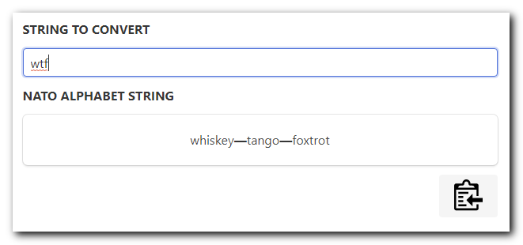

# NATO Alphabet Converter

A simple way to make phrases (especially passwords) easier to communicate when spoken by converting all characters on a US keyboard to the NATO phonetic alphabet. I call this conversion process "natoizing".

# Usage

* Enter the phrase to be converted
* Witness the wonder of NATO alphabet conversion before your very eyes.
