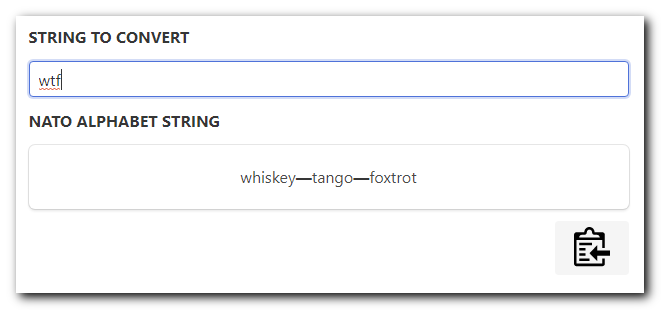

# NATO Alphabet Converter

A simple way to convert phrases (especially passwords) to the NATO alphabet in order to to tell someone the phrase audibly. It supports all characters on a US keyboard. I call this conversion process "natoizing".

# Usage

* Enter the phrase to be converted
* Witness the wonder of NATO alphabet conversion before your very eyes.

Try out the [NATO Alphabet Converter](https://natoize.danhersam.com/).

## Interpreting the letters

Letters are all lowercase or uppercase to indicate a lowercase or capital letter. For example, whiskey = w, WHISKEY = W.

Numbers and named characters start with a capital letter to distinguish them from normal letters. For example, Three = 3, Dollar = $.
